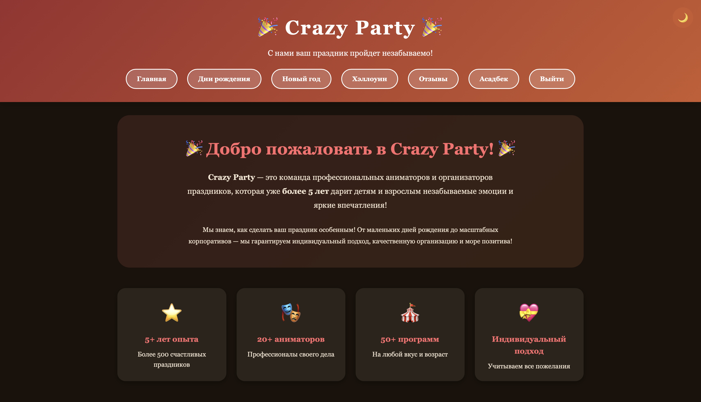
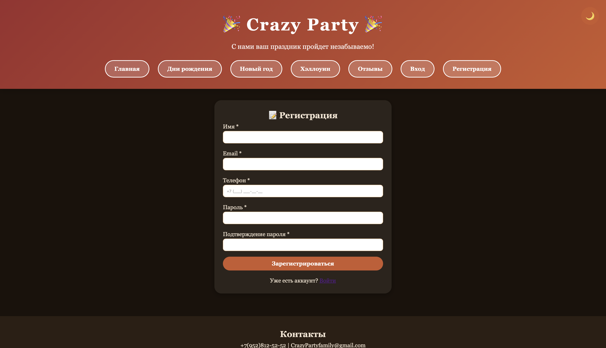
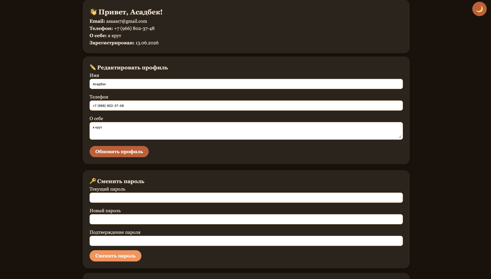
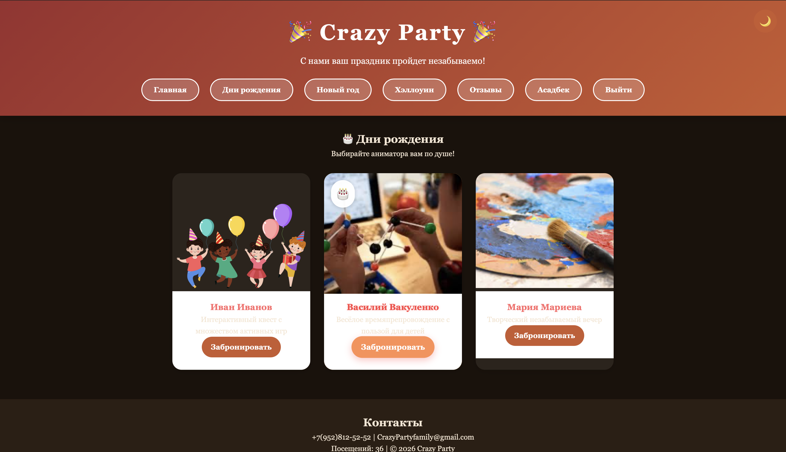

cat > README.md << 'EOF'
# 🎉 Crazy Party - Организация праздников

Веб-приложение для бронирования аниматоров на дни рождения, Новый год и Хэллоуин.

## 📸 Скриншоты

### Главная страница


### Страница регистрации



### Личный кабинет


### Страница бронирования


## 🚀 Функционал

- ✅ Регистрация и авторизация пользователей
- ✅ Хэширование паролей (bcrypt)
- ✅ Личный кабинет с редактированием профиля
- ✅ Смена пароля
- ✅ Поле "О себе" (bio)
- ✅ Отслеживание last_login
- ✅ Бронирование аниматоров с выбором даты и времени
- ✅ Просмотр и отмена бронирований
- ✅ Обратная связь и отзывы
- ✅ REST API с фильтрацией
- ✅ Адаптивный дизайн
- ✅ Тёмная/светлая тема
- ✅ Анимации при наведении

## 🛠 Технологии

- **Backend:** Python, Flask, Flask-Login, Flask-Bcrypt, Flask-SQLAlchemy
- **Frontend:** HTML5, CSS3, JavaScript (Vanilla)
- **Database:** SQLite
- **Templating:** Jinja2

## 📦 Установка и запуск

```bash
# 1. Клонировать репозиторий
git clone https://github.com/asaass7/crazy-party.git
cd crazy-party

# 2. Создать виртуальное окружение
python3 -m venv venv
source venv/bin/activate

# 3. Установить зависимости
pip install -r requirements.txt

# 4. Запустить приложение
python app.py
